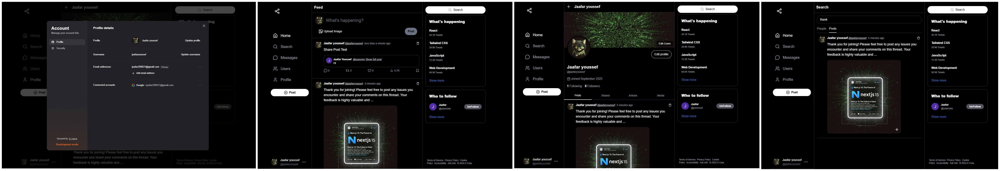
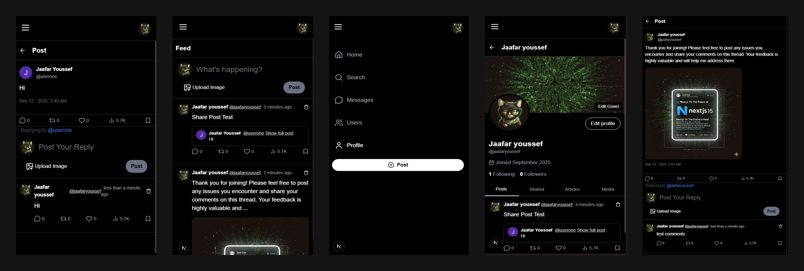

# Share – Social Media Website (Next.js 15)

**Share** is a social media web app built with **Next.js 15, MongoDB, and Clerk**.  
It allows users to:  
- Sign up, sign in, and sign out with Clerk authentication  
- Create posts with photos  
- Like, comment, and share posts  
- Delete posts  
- Customize their profile (profile photo, cover photo, display name, username)  

---

## Welcome!
Thanks for checking out this application.

---

## Overview
### Desktop  

### Mobile  

---

## Links
- **Live Site:** [Share App](https://repo-zeta-two.vercel.app/)

---

## My Process

### Built With
- [Next.js 15](https://nextjs.org/)  
- [MongoDB](https://www.mongodb.com/)  
- [Clerk](https://clerk.com/)  
- [ImageKit.io](https://imagekit.io/)  
- [Tailwind CSS](https://tailwindcss.com/)  
- TypeScript / TSX  

---

## Author
- LinkedIn – [Jaafar Youssef](https://www.linkedin.com/in/jaafar-youssef-923100249/)  
